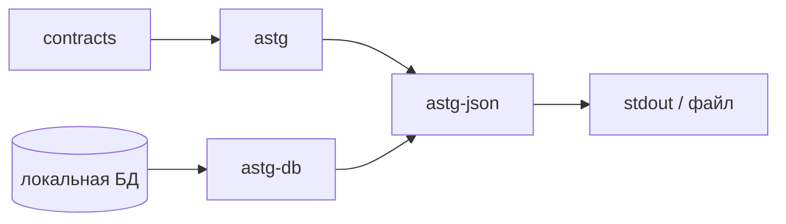
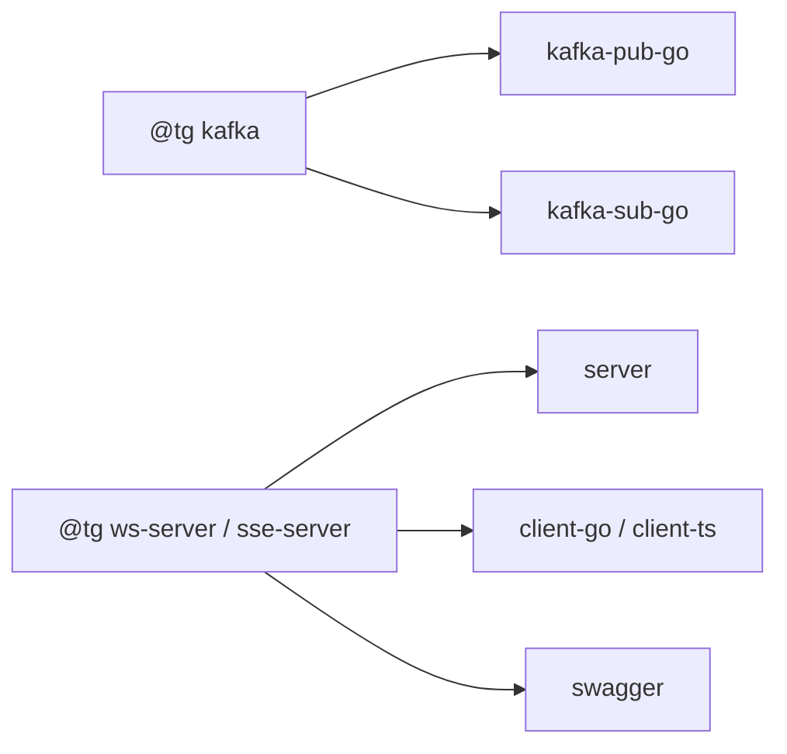
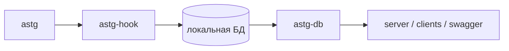

# Changelog

## 1.0.9 — 2026-08-01

### Плагины

| Плагин | Изменение |
|--------|-----------|
| `astg-json` | новый: `tg astg json [-o …] [--from-db …]` — экспорт resolved ASTG-модели в JSON |



### Поведение

| Область | Дельта |
|---------|--------|
| `astg` | именованные скаляры с typed const (≥2) → `Type.Enums` (без обязательного `@tg enums`) |
| `swagger` | typed enums → `$ref` + `enum`; `@tg enums` на голых скалярах — как раньше |
| `client-go` / `client-ts` | генерация типизированных констант из `Type.Enums` |
| `client-ts` | stream-методы принимают `signal?: AbortSignal` (SSE — `fetch`/`reader`, WS — закрытие сокета) |
| `server` | SSE pump в runtime: `OpenSSE` / `PumpSSEServerStreamTyped`, `SetSSEHeartbeat`, `X-Accel-Buffering: no` |
| `server` | write deadline SSE сбрасывается до `OpenSSE` (Fiber переиспользует `Ctx` в `SetBodyStreamWriter`) |
| `astg-db` | `all-contracts=true` — полная модель из БД без интерактивного выбора контрактов |

| Enums | Было | Стало |
|-------|------|-------|
| именованный тип + `const` | только через `@tg enums=…` на поле | автосбор в модель → OpenAPI / клиенты |
| голый скаляр | `@tg enums=…` | без изменений |

### Установка

```bash
tg pkg add https://github.com/seniorGolang/tgp-go:astg-json
```

---

## 1.0.8 — 2026-07-24

### Плагины

| Плагин | Изменение |
|--------|-----------|
| `kafka-pub-go` | новый: `tg kafka pub go -o …` |
| `kafka-sub-go` | новый: `tg kafka sub go -o …` |
| `server` / `client-go` / `client-ts` / `swagger` | генерация WebSocket / SSE stream |
| релиз пакета | в поставку входят skills плагинов |



### Аннотации

| Аннотация | Уровень | Назначение |
|-----------|---------|------------|
| `ws-server` | iface | WebSocket stream |
| `sse-server` | iface | SSE server-stream |
| `stream=server\|client\|bidi` | method | направление потока |
| `ws-path` / `sse-path` | method | путь endpoint |
| `kafka` | iface | контракт событий Kafka |
| `kafka-topic` / `kafka-key` / `kafka-headers` / `kafka-message` | method | топик, ключ, headers, тело |
| `kafka-codec` / `kafka-acks` | iface / method | кодек и acks |

### Поведение

| Область | Дельта |
|---------|--------|
| stream wire | JSON-RPC 2.0 (`$/stream`, `$/stream.end`, `$/cancel`); SSE — `text/event-stream` |
| headers на stream | SSE — из HTTP-запроса; WS — из upgrade (connection-scoped); в браузере TS дублирует headers в query |
| XML exchange | при `requestContentType` / `responseContentType` = XML — XML-теги и root wrap/unwrap (TS) |
| `astg-db` | см. матрицу `from-db` ниже |

| Ввод | Выбор проекта | Выбор контрактов |
|------|---------------|------------------|
| `--from-db` (пусто) | да | да |
| `--from-db project@version` | нет | да |
| `--from-db project:C1,C2@version` | нет | нет |
| `--from-db project@version --contracts C1,C2` | нет | нет |

### Установка

```bash
tg pkg add https://github.com/seniorGolang/tgp-go:kafka-pub-go
tg pkg add https://github.com/seniorGolang/tgp-go:kafka-sub-go
```

---

## 1.0.7 — 2026-07-14

### Аннотации

| Было | Стало |
|------|-------|
| аннотации только на пакет / iface / method / поле | + sub на методе: `// @tg <arg\|result>.<key>` |
| приоритет method → iface → пакет | поле/параметр → sub → method → iface → пакет |

| Sub-ключ | Назначение |
|----------|------------|
| `required`, `desc`, `format`, `example`, `enums`, `type` | как у поля/параметра |
| `tags` | `json:inline`, `json:…,omitempty`, `form:…`, `dumper:hide` |
| `log-skip`, `http-part-name`, `http-part-content` | логирование / multipart |

### Поведение

| Область | Дельта |
|---------|--------|
| JSON-RPC batch | общий batch всегда `POST /`; дополнительно mount’ы по `http-prefix` (и предкам) со scoped картой методов |
| HTTP argmap | единые режимы path / body omit / header / cookie |
| `server` | `clientId` в логах и `client_id` в метриках из `X-Client-Id` (иначе `unknown`) |
| `client-ts` | по умолчанию шлёт `X-Client-Id`; опция `--no-client-id` отключает |
| `client-ts` | `--package-json` + `@tg npmName` → `package.json` / `tsconfig` с `outDir: dist` |
| `swagger` | `required` явный и выведенный; sub на методе в схемах |

| Контекст OpenAPI | `required`, если… |
|------------------|-------------------|
| поле тела запроса | не указатель и нет `omitempty` |
| поле тела ответа | нет `omitempty` (указатель без `omitempty` — обязателен) |
| query | не указатель; указатель — только при `@tg required` / `<var>.required` |
| header / cookie | только при явном `required` |

---

## 1.0.6 — 2026-07-08

### Поведение

| Плагин | Дельта |
|--------|--------|
| `astg-db` | пустой `--from-db`: выбор проекта, затем множественный выбор контрактов; пустая база / отмена → ошибка |
| `init-go` | scaffold без `automaxprocs` |
| `server` | HTTP-типы транспорта генерируются только при наличии HTTP-контрактов |

---

## 1.0.5 — 2026-05-25

### Миграция

| Область | Было | Стало |
|---------|------|-------|
| `client-go` endpoint | `endpoint` + `rpcEndpoint` | один `endpoint` (HTTP и JSON-RPC) |
| `client-go` ошибки | один `DecodeError` | `DecodeError` (JSON-RPC) + `DecodeHTTPError` (REST) |
| `client-ts` ошибки | только JSON-RPC decoder | + `ResponseError` / `HTTPErrorDecoder` |
| sub-теги | `tags.result=…` | `result.tags=…` |
| toolchain | Go 1.25 | Go 1.26 |

### Возможности

| Область | Дельта |
|---------|--------|
| inline | поддержка inline-полей / `json:inline` в генераторах |
| `swagger` | success без payload; default-схема ошибок без HTTP-кода |

---

## 1.0.3 — 2026-04-13

### Поведение

| Плагин | Дельта |
|--------|--------|
| `swagger` | отдельная schema тела запроса; неявные режимы аргументов не попадают в query |
| `server` | единый конвейер string→тип для header / cookie / query (HTTP и JSON-RPC); lenient → zero-value, строгий `Parse` / `Parse{Type}` у доменного типа |
| `server` | multipart: без pre-parse form в Fiber; строгий порядок частей `io.Reader` и EOF |

---

## 1.0.2 — 2026-03-23

### Плагины

| Плагин | Назначение |
|--------|------------|
| `astg-db` | загрузка модели из локальной БД (`from-db`, ref `project[:contracts][@version]`) |
| `astg-hook` | сохранение модели в локальную БД после разбора |



### Возможности

| Область | Дельта |
|---------|--------|
| `http-headers` / `http-cookies` / `http-args` | режимы `explicit` \| `implicit` \| `body` |
| `swagger` / `astg` | security-схемы: `http`, `apiKey`, `oauth2`, `openId`; аннотации на полях |

---

## 1.0.1 — 2026-02-13

### Поведение

| Область | Дельта |
|---------|--------|
| `http-prefix` | в `http-path` нужен ведущий `/` |
| `client-go` / `server` | multipart / form / content-type в HTTP |
| метрики клиента | лейбл `service` = lowerCamel контракта; + `client_id` |

---

## 1.0.0 — 2026-02-06

Первый релиз плагинов:

| Плагин | Роль |
|--------|------|
| `astg` | модель контрактов |
| `server` | Fiber HTTP / JSON-RPC |
| `client-go` | Go-клиент |
| `client-ts` | TypeScript-клиент |
| `swagger` | OpenAPI 3.0 |
| `init-go` | scaffold Go-проекта |
