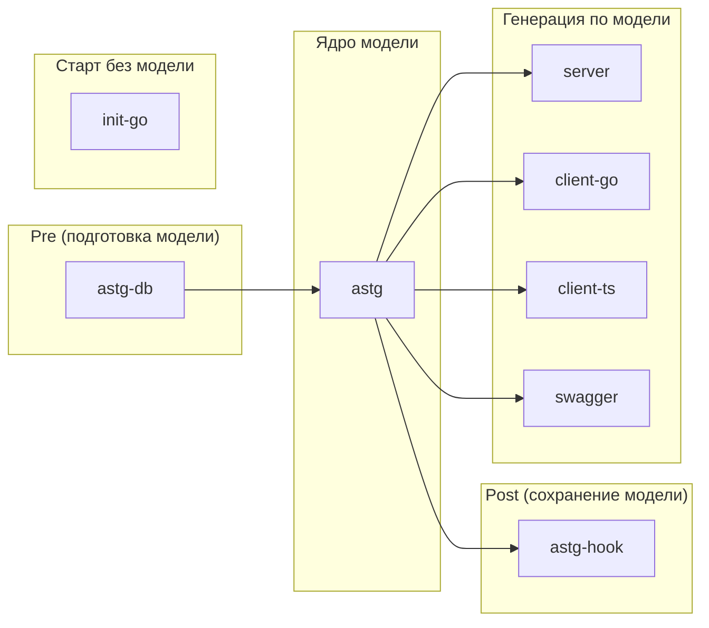
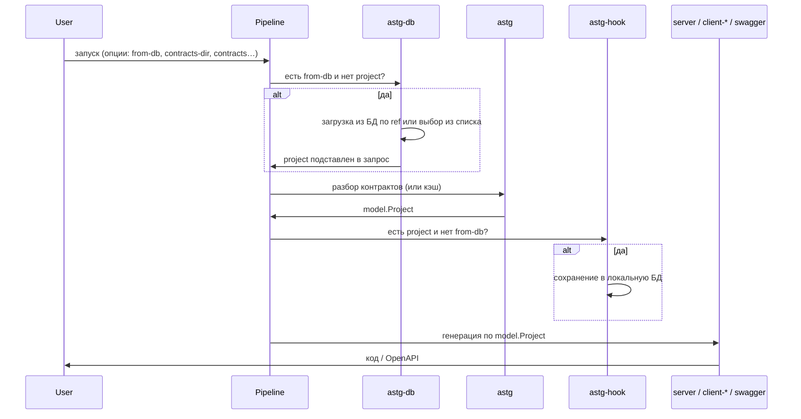

# Плагины для генерации кода (tgp-go)

Набор плагинов для системы [tg](https://github.com/seniorGolang/tg/v3) (Tool Gateway): генерация серверного и клиентского кода, документации API и заготовок проектов на основе Go-интерфейсов с аннотациями `@tg`.

Все плагины работают с **единой моделью проекта** (контракты, типы, методы, аннотации). Модель строит плагин **astg**; остальные плагины либо подготавливают/сохраняют её, либо генерируют по ней код и документацию.

---

## Роли плагинов и связи



- **astg** — единственный источник модели: разбирает Go-код и собирает контракты в единую структуру.
- **astg-db** и **astg-hook** работают с локальной базой контрактов: загрузка по ссылке и сохранение после разбора.
- **server**, **client-go**, **client-ts**, **swagger** используют уже собранную модель и генерируют код/документацию.
- **init-go** не использует модель: создаёт новый Go-проект с контрактами и заглушками «с нуля».

---

## Поток данных в пайплайне



---

## Плагины: суть и возможности

### astg

**Суть:** Парсер Go-проекта и источник единой модели. Находит контракты (интерфейсы с `@tg`), методы, типы и аннотации; собирает из них структурированную модель, которую используют все генераторы.

**Возможности:** Обнаружение контрактов и типов, разбор аннотаций на уровнях пакет/интерфейс/метод/поле, разрешение импортов, кэш по дереву Меркла (go.mod, go.sum, .go), подстановка описаний из файлов (`file:path`, `file:path#section`).

**Связи:** Зависимость всех плагинов генерации; опционально подменяется/дополняется astg-db (модель из БД) и дополняется astg-hook (сохранение в БД).

---

### astg-db

**Суть:** Pre-плагин: подставляет в запрос модель проекта из **локальной базы контрактов**, чтобы не разбирать репозиторий при каждом запуске.

**Возможности:** Загрузка по ссылке вида `проект@версия` или `проект:Контракт1,Контракт2@версия`, интерактивный выбор из списка сохранённых ref, фильтр контрактов. Срабатывает только если модели ещё нет и указана опция `from-db`.

**Связи:** Зависит от astg (в пайплайне). База заполняется плагином astg-hook.

---

### astg-hook

**Суть:** Сохраняет текущую модель проекта в локальную базу контрактов после того, как она получена в пайплайне (например, плагином astg). Позволяет один раз разобрать репо и дальше использовать сохранённую версию через astg-db.

**Возможности:** Автосохранение по идентификатору проекта и версии (ветка/тег или default). Не сохраняет, если в запросе уже была загрузка из БД (`from-db`), чтобы не перезаписывать текущую версию.

**Связи:** Выполняется после astg; база используется плагином astg-db.

---

### server

**Суть:** Генератор серверного кода на [Fiber](https://github.com/gofiber/fiber): по контрактам строит HTTP REST и JSON-RPC 2.0 обработчики. Остаётся передать реализации интерфейсов и запустить сервер.

**Возможности:** Маршруты по аннотациям (http-method, http-path, http-args, headers, cookies), batch для JSON-RPC, опциональные логирование/метрики/трассировка (log, metrics, trace), типобезопасные обработчики и единая обработка ошибок.

**Связи:** Использует модель от astg (или подставленную astg-db).

---

### client-go

**Суть:** Генератор типобезопасного Go-клиента к API: вызовы по контрактам через JSON-RPC 2.0 и HTTP REST.

**Возможности:** Методы по сигнатурам интерфейсов, batch для JSON-RPC, настраиваемые пути/заголовки/cookie, опциональные логирование и метрики, свой HTTP-клиент и декодер ошибок, генерация readme по клиенту.

**Связи:** Использует модель от astg (или astg-db).

---

### client-ts

**Суть:** Генератор TypeScript-клиента для браузера и Node.js: типобезопасные асинхронные методы по контрактам (JSON-RPC и HTTP REST).

**Возможности:** Promise-API, batch, Blob/FormData для файлов, статические и динамические заголовки (в т.ч. async), готовность к публикации в NPM (аннотации npmName, npmRegistry и др.), генерация документации с примерами.

**Связи:** Использует модель от astg (или astg-db).

---

### swagger

**Суть:** Генератор описания API в формате **OpenAPI 3.0** по контрактам: пути, схемы, параметры, примеры и авторизация для использования в Swagger UI, Postman и др.

**Возможности:** Единая спецификация для HTTP и JSON-RPC, схемы данных и группировка по тегам, вывод в JSON/YAML, встроенный режим просмотра в браузере (`--serve`).

**Связи:** Использует модель от astg (или astg-db).

---

### init-go

**Суть:** Создаёт заготовку Go-проекта: каталоги, контракты (JSON-RPC и/или REST), заглушки сервисов, заготовку транспорта и точку входа. Транспорт и OpenAPI достраиваются через `go generate ./...`.

**Возможности:** Выбор модуля, списков JSON-RPC и REST-интерфейсов, генерация contracts/, internal/services/, internal/transport/, cmd и pkg/errs. Не использует существующую модель — только параметры команды.

**Связи:** Не зависит от других плагинов; даёт стартовый проект для последующего использования astg, server, swagger и т.д.

---

## Установка и документация

Требуется платформа [tg](https://github.com/seniorGolang/tg/v3):

```bash
go install github.com/seniorGolang/tg/v3/cmd/tg@latest
```

Установка плагинов (все или выборочно):

```bash
tg pkg add https://github.com/seniorGolang/tgp-go
tg pkg add https://github.com/seniorGolang/tgp-go:server
tg pkg add https://github.com/seniorGolang/tgp-go:client-go
tg pkg add https://github.com/seniorGolang/tgp-go:client-ts
tg pkg add https://github.com/seniorGolang/tgp-go:swagger
tg pkg add https://github.com/seniorGolang/tgp-go:init-go
tg pkg add https://github.com/seniorGolang/tgp-go:astg-db
tg pkg add https://github.com/seniorGolang/tgp-go:astg-hook
```

Подробное описание каждого плагина (аннотации, опции, примеры):

```bash
tg plugin doc <имя-плагина>
# например: astg, server, client-go, client-ts, swagger, init-go, astg-db, astg-hook
```

---

## Аннотации @tg

Аннотации задаются в комментариях к Go-коду с префиксом `@tg` на уровнях: пакет → интерфейс → метод → поле/параметр (приоритет: метод переопределяет интерфейс, интерфейс — пакет). Полный список и значения — в документации плагина astg: `tg plugin doc astg`.

---

## Лицензия и автор

Проект распространяется под лицензией MIT ([LICENSE](LICENSE)).  
Автор: AlexK (seniorGolang@gmail.com).
